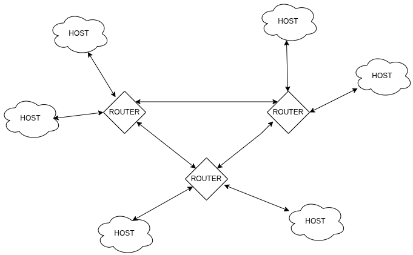
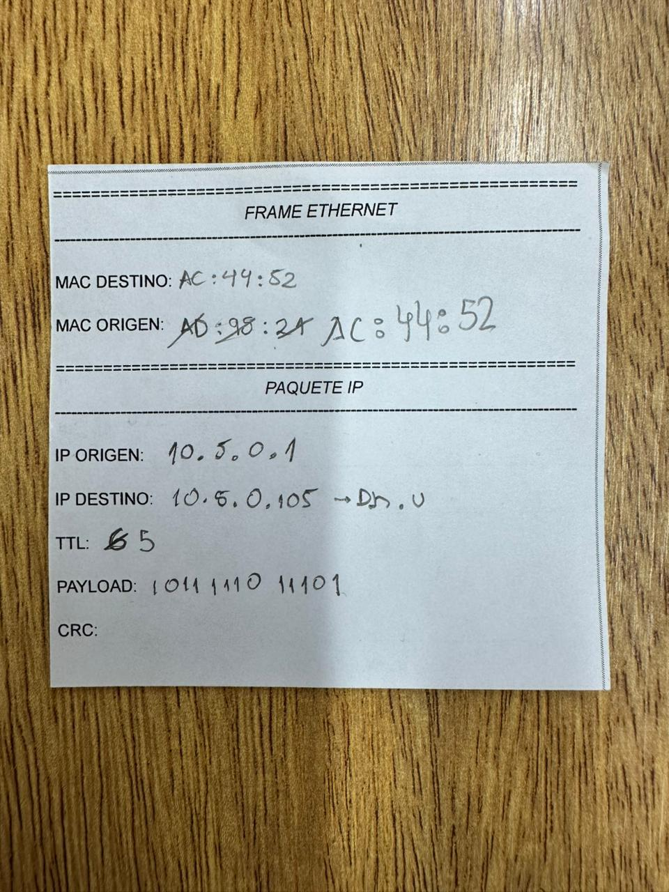
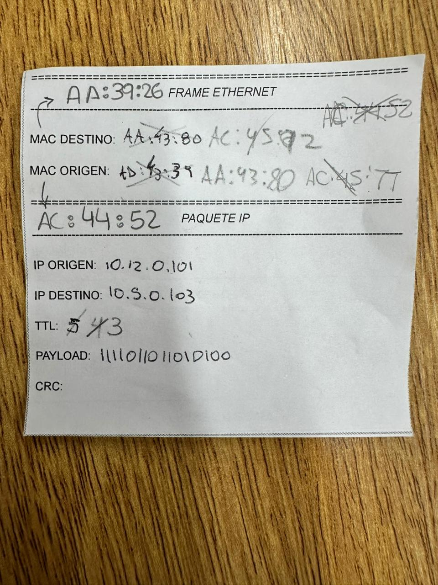
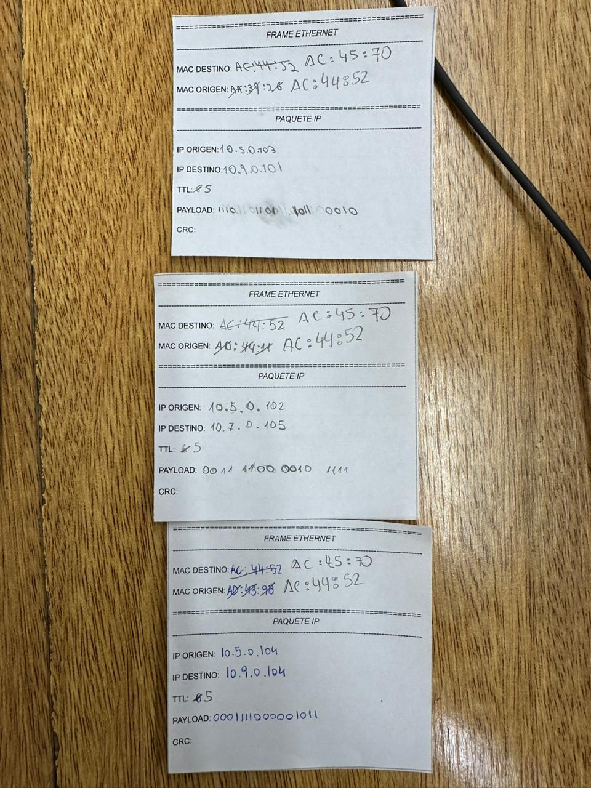

# Trabajo Practico N1

- **Gastón E. Capdevila**
- **Nicolas Seia**
- **Ignacio Ledesma**
- **Tomas Viberti**  
 
## Ensalada WANdorf 2.0

**Facultad de ciencias Exactas Fisicas y Naturales**  

**Redes de Computadoras**

**Profesores:**
- SANTIAGO MARTIN HENN
- OLIVA CUNEO FACUNDO NICOLAS 

**16/3/2026**   

---

### Información de los autores
 
- gaston.capdevila@mi.unc.edu.ar
- nicolas.seia@unc.edu.ar
- iledesma@mi.unc.edu.ar
- tomas.viberti@mi.unc.edu.ar

## Resumen

*Palabras clave*: 

## Introducción

## Desarrollo 

### 1)

Para comenzar con el trabajo, fue necesario realizar la topografía de la red que íbamos a simular; para ello, entre todos los grupos fuimos armando su topología. Se planteó el problema de tener tres routers, los cuales son los nodos centrales encargados de reenviar los paquetes a su destino correcto. Por otro lado, definimos hosts que estaban comunicados únicamente con alguno de los routers centrales.

A continuación, detallo la red:

### 2)

En este paso, cada grupo asignó un router por defecto (default gateway), el cual era el encargado de comunicarse con el router central. Es decir, cada host debía estar vinculado a su router y, a su vez, este debía contar con una tabla con las direcciones internas conocidas del host. En el caso del router central, este debía tener la referencia de la dirección IP de su respectivo host.

Se designó un router por defecto y los demás dispositivos actuaron como hosts. A continuación, detallo la tabla de ruteo interna:

| Dispositivo / Rol | Dirección IP |
| :--- | :--- |
| Gateway / Router | `10.4.0.1` |
| Host 1 | `10.4.0.101` |
| Host 2 | `10.4.0.102` |
| Host 3 | `10.4.0.103` |

### 3)

La etapa de conformación de paquetes se llevó a cabo de la siguiente manera: en el Drive compartido de la cátedra, se creó una tabla vinculada a cada legajo con valores definidos aleatoriamente y sin repeticiones. Esto permitió que cada alumno pudiera crear su propio paquete encapsulado de forma única.

En esta fase, trabajamos en conjunto con el grupo "The Lords of Pings" para realizar la actividad. A continuación, utilizaremos como ejemplo el paquete empleado para dicha actividad compartida:

### Detalle de Encapsulamiento

**Frame Ethernet**
| Campo | Valor |
| :--- | :--- |
| MAC Destino | `AC:44:52` |
| MAC Origen | `AD:43:98` |

**Paquete IP**
| Campo | Valor |
| :--- | :--- |
| IP Origen | `10.5.0.104` |
| IP Destino | `10.9.0.104` |
| TTL | `6` |
| Payload | `0001 1110 0000 1011` |
| CRC |  |

### 4)

#### 1. Generación y Encapsulamiento (Origen - LAN)
Cada integrante del grupo asumió el rol de LAN, iniciando la construcción del paquete en formato físico (papel). Se definieron los siguientes parámetros críticos:

- Direccionamiento de Capa 2: Se asignó la dirección MAC de origen.
- Direccionamiento de Capa 3: Se establecieron las IP de origen y destino.
- Control y Datos: Se fijó el TTL (Time to Live) en 6 y se cargó el Payload en formato binario.

#### 2. Entrega al Gateway (Salida de la Red Local)
Una vez conformado el paquete, este se entregó al Default Gateway. Este nodo actuó como el intermediario necesario para que el tráfico local pudiera alcanzar el núcleo de la red (los routers centrales).

#### 3. Conmutación y Ruteo (Core de la Red)
Los Routers Centrales (gestionados por otro grupo) recibieron los paquetes de sus respectivos hosts. El proceso de decisión se basó en:

- Consulta de Tablas de Ruteo: Los tres routers centrales se comunicaron entre sí para determinar cuál de ellos tenía conexión directa con la IP de destino.
- Procesamiento del Paquete: * Se analizó la cabecera IP.
   - Se realizó el decremento del TTL (TTL - 1).
   - Se llevó a cabo el re-encapsulamiento de la dirección MAC para el siguiente salto.
- Manejo de Errores (Destino Inalcanzable): Si la IP de destino no existía en ninguna tabla, el paquete se devolvió al emisor con una notificación de error (simulando un mensaje ICMP Destination Unreachable).

#### 4. Entrega Final (Destino)
Si el router central lograba localizar la red del host de destino, el paquete era reenviado exitosamente, completando el ciclo de comunicación al llegar a la interfaz del receptor final.

Detallo capturas del proceso:

### 5)

**a)** 

Podemos decir que el "direccionamiento lógico" (IP), se mantiene constante ya que identifica el punto final de la comunicación a nivel global, la cual se lo conoce como capa 3. En cambio el "direccionamiento físico" es un identificador local (capa 2), que tiene como funcionalidad de mover el paquete entre nodo y nodo dentro de un mismo enlace físico.

**b)** 

Un host solo puede descubrir direcciones MAC de dispositivos que están en su propia red local. No buscan descubrir la MAC de destino final porque, como comentamos anteriormente, va de salto en salto entre los nodos de un mismo enlace. 

El problema que se resuelve, es que el host "no sabe" como llegar a redes externas; solo sabe que si el destino no es local, debe pasarle el paquete al default gateway. Este actua como puente que tiene la capacidad de analizar la IP destino y decidir hacia que ruta externa debe encaminar el paquete.

**c)** 

Este modelo, hop-by-hop, es fundamental por diferentes razones como:

- Eficiencia de memoria: Ningun router necesita conocer el mapa completo de internet, solo necesita saber su vecino.
- Flexibilidad: Si un enlace falla, los routers actualizan sus tablas locales para desviar el trafico sin que el origen tenga que realizar una reconfiguracion.
- Simplicidad: Reduce la carga de sobreprocesamiento.

**d)** 

El desencapsulado y re-encapsulado es necesario porque el "Frame Ethernet" tiene validez solo en el enlace fisico actual. Quiere decir que al llegar a un router, ese frame "muere" ya que cumplió su función de llevar el paquete al router. Luego debe crear un nuevo frame y pasarselo al siguente nodo.

Si no se hiciera, se generaria un bucle o que el siguiente dispositivo ignore el paquete porque la MAC de destino seguira siendo la del propio router que lo recibió.

**e)** 

Time to Live (TTL) previene que los paquetes circulen infinitamente en la red en case de que existan bucles de ruteo. 

Si hubiera un error en las tablas y entre dos routers se envian el paquete constantemente, la red se saturaria muy rapido, generando colapsos en la infraestructura. Para asegurarse de que no suceda aparece TTL, que tras N saltos, el paquete se descarte y se liberen recursos.

### 2)
