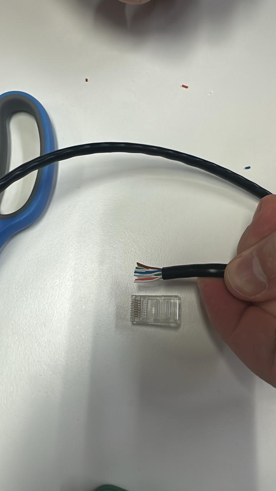
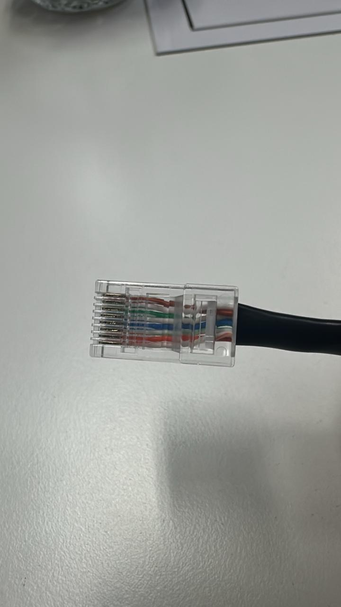

# Trabajo Practico N2

- **Gastón E. Capdevila**
- **Nicolas Seia**
- **Ignacio Ledesma**
- **Tomas Viberti**  
 
## Ensalada WANdorf 2.0

**Facultad de ciencias Exactas Fisicas y Naturales**  

**Redes de Computadoras**

**Profesores:**
- SANTIAGO MARTIN HENN
- OLIVA CUNEO FACUNDO NICOLAS 

**03/04/2026**   

---

### Información de los autores
 
- gaston.capdevila@mi.unc.edu.ar
- nicolas.seia@unc.edu.ar
- iledesma@mi.unc.edu.ar
- tomas.viberti@mi.unc.edu.ar

## Resumen

## Introducción

## Parte 1

### 1-2)

Se llevo a cabo la investigacion de como es la construcción de un cable tipo "DERECHO", guiandonos de la norma T568A/B DERECHO, como tambien de videos sobre como realizar la construcción del mismo.

Para ello se llevo una serie de pasos:
1. Desenvainado (o Pelado) del cable
Utilizando la cuchilla de la pinza crimpeadora o un pelacables universal, se retira aproximadamente 2 o 3 cm de la vaina (la cubierta exterior de PVC). Hay que tener cuidado de no cortar el aislamiento de los hilos de cobre internos.

2. Destrenzamiento y Alineación
Los cuatro pares de hilos vienen trenzados para cancelar interferencias. Destrenzar los pares y enderezar cada hilo conductor lo mejor posible para que queden paralelos.

3. Ordenamiento según Norma (Código de Colores)
Se deben disponer los hilos de izquierda a derecha (con la pestaña del conector mirando hacia abajo) siguiendo la norma elegida. La T568B es:

   - Blanco-Naranja / Naranja

   - Blanco-Verde / Azul

   - Blanco-Azul / Verde

   - Blanco-Marrón / Marrón

4. Nivelación y Corte de Precisión
Una vez ordenados y bien juntos, se utiliza la cuchilla de corte de la pinza para realizar un corte transversal limpio. El objetivo es que todos los conductores tengan la misma longitud (aprox. 1.2 cm desde la vaina) para que lleguen al fondo del conector.

5. Inserción en el Conector RJ-45
Se introducen los hilos en el conector. Es vital asegurarse de que:

   - Cada hilo entre en su carril correspondiente.

   - Las puntas de cobre toquen el fondo del conector.

   - La vaina del cable entre dentro del conector para que quede sujeta por la cuña de plástico.

6. Crimpado (o Engastado)
Se introduce el conector en la cavidad de la pinza y se presiona con firmeza. Este proceso hace que las cuchillas metálicas del conector atraviesen el aislante de los hilos (haciendo contacto) y que el plástico del conector asegure mecánicamente el cable.

### 3)

Luego de la construcción realizamos la verificación de los cables construidos, y realizamos el testeo de si los cables estaban bien conectados. Mediante un tester para cables ethernet se realizo la prueba.

---

## Parte 2

### 1)

### 2)

### 3)

