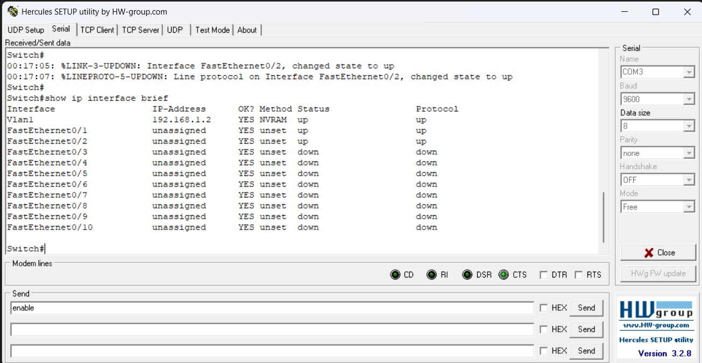
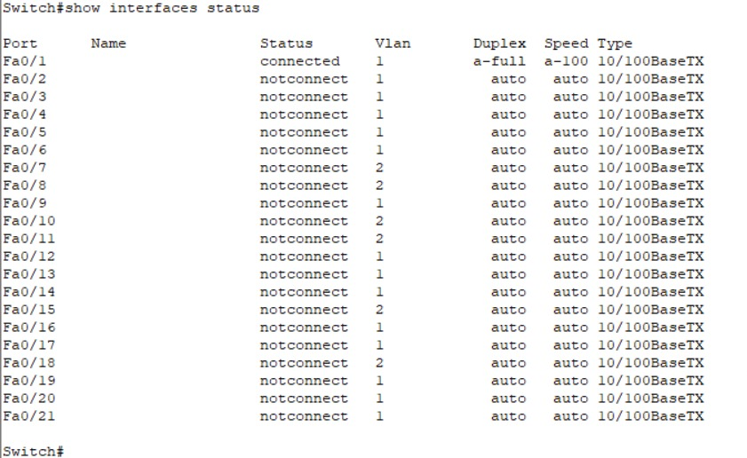
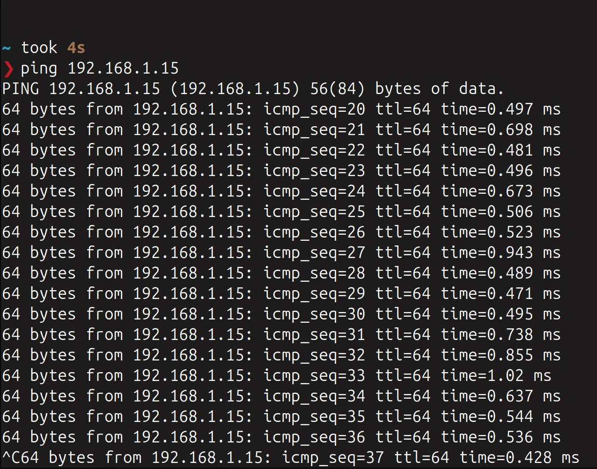
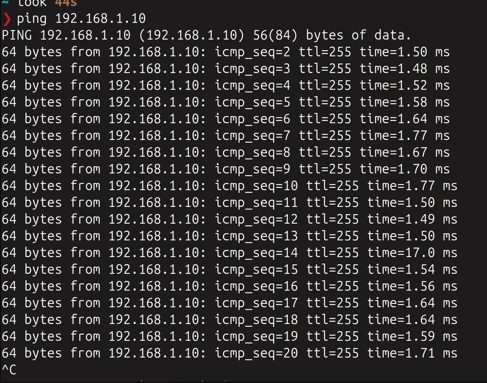
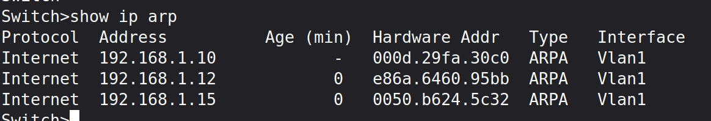
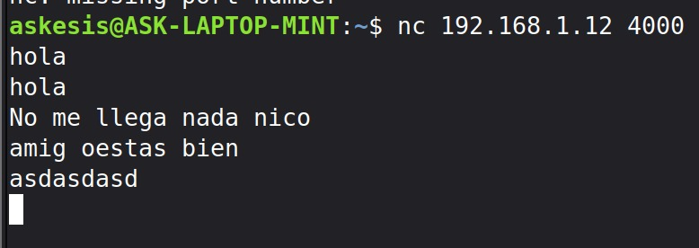
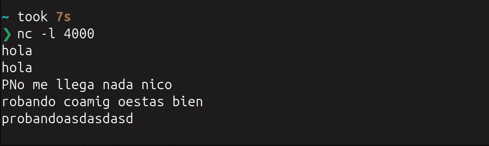

# Trabajo Practico N2

- **Gastón E. Capdevila**
- **Nicolas Seia**
- **Ignacio Ledesma**
- **Tomas Viberti**  
 
## Ensalada WANdorf 2.0

**Facultad de ciencias Exactas Fisicas y Naturales**  

**Redes de Computadoras**

**Profesores:**
- SANTIAGO MARTIN HENN
- OLIVA CUNEO FACUNDO NICOLAS 

**03/04/2026**   

---

### Información de los autores
 
- gaston.capdevila@mi.unc.edu.ar
- nicolas.seia@unc.edu.ar
- iledesma@mi.unc.edu.ar
- tomas.viberti@mi.unc.edu.ar

## Resumen

Este trabajo práctico documenta la implementación de una red local, desde la infraestructura física hasta la capa de aplicación. En la primera etapa, se detalla la confección de cables UTP bajo la norma T568B. En la segunda, se describe la administración de un switch Cisco Catalyst 2950 mediante consola. El éxito de la configuración se validó mediante pruebas de conectividad ICMP (Ping), inspección de tablas ARP y la ejecución de un chat bidireccional con Netcat, verificando el correcto funcionamiento de la pila de protocolos TCP/IP.

## Introducción

El objetivo de este laboratorio es integrar los conceptos teóricos del modelo OSI en un entorno práctico de red. El desarrollo se divide en dos ejes: el medio físico, centrado en la normativa y precisión del cableado estructurado, y la configuración lógica, enfocada en la administración de dispositivos de conmutación. A través de este proceso, se busca analizar el flujo de datos, el direccionamiento y la comunicación extremo a extremo, validando empíricamente cómo interactúan las diferentes capas de red para lograr una transferencia de información exitosa.

## Parte 1

### 1-2)

Se llevo a cabo la investigacion de como es la construcción de un cable tipo "DERECHO", guiandonos de la norma T568A/B DERECHO, como tambien de videos sobre como realizar la construcción del mismo.

Para ello se llevo una serie de pasos:
1. Desenvainado (o Pelado) del cable
Utilizando la cuchilla de la pinza crimpeadora o un pelacables universal, se retira aproximadamente 2 o 3 cm de la vaina (la cubierta exterior de PVC). Hay que tener cuidado de no cortar el aislamiento de los hilos de cobre internos.

2. Destrenzamiento y Alineación
Los cuatro pares de hilos vienen trenzados para cancelar interferencias. Destrenzar los pares y enderezar cada hilo conductor lo mejor posible para que queden paralelos.

3. Ordenamiento según Norma (Código de Colores)
Se deben disponer los hilos de izquierda a derecha (con la pestaña del conector mirando hacia abajo) siguiendo la norma elegida. La T568B es:

   - Blanco-Naranja / Naranja

   - Blanco-Verde / Azul

   - Blanco-Azul / Verde

   - Blanco-Marrón / Marrón

4. Nivelación y Corte de Precisión
Una vez ordenados y bien juntos, se utiliza la cuchilla de corte de la pinza para realizar un corte transversal limpio. El objetivo es que todos los conductores tengan la misma longitud (aprox. 1.2 cm desde la vaina) para que lleguen al fondo del conector.

5. Inserción en el Conector RJ-45
Se introducen los hilos en el conector. Es vital asegurarse de que:

   - Cada hilo entre en su carril correspondiente.

   - Las puntas de cobre toquen el fondo del conector.

   - La vaina del cable entre dentro del conector para que quede sujeta por la cuña de plástico.

6. Crimpado (o Engastado)
Se introduce el conector en la cavidad de la pinza y se presiona con firmeza. Este proceso hace que las cuchillas metálicas del conector atraviesen el aislante de los hilos (haciendo contacto) y que el plástico del conector asegure mecánicamente el cable.

### 3)

Luego de la construcción realizamos la verificación de los cables construidos, y realizamos el testeo de si los cables estaban bien conectados. Mediante un tester para cables ethernet se realizo la prueba.

---

## Parte 2

El objetivo de esta fase fue establecer una comunicación exitosa entre el software de administración y el hardware (Cisco Catalyst 2950), configurar los parámetros de red y validar el flujo de datos en las distintas capas del modelo OSI.

**Paso 1: Establecimiento de la conexión de consola**

Para la gestión inicial, conectamos la PC al puerto de consola del Switch utilizando el cable diseñado en la Parte 1. Configuramos el software Hercules SETUP utility (o PuTTy) con los siguientes parámetros serie estándar:

- Puerto: COM3 (según el adaptador utilizado).
- Baud rate: 9600.
- Data size: 8 bits, sin paridad y 1 bit de parada.

Al encender el equipo, observamos en los logs cómo las interfaces cambiaban su estado a "up" (Capa 1 activa).

**Paso 2: Verificación del estado de interfaces**

Una vez dentro de la consola del Switch (modo privilegiado #), ejecutamos comandos de diagnóstico para verificar que el hardware reconociera nuestras conexiones físicas.

1. show ip interface brief: Nos permitió ver de forma resumida que la VLAN 1 tenía asignada la IP 192.168.1.2 y que las interfaces FastEthernet0/1 y 0/2 estaban operativas (Status: up / Protocol: up).

2. show interfaces status: Con este comando validamos la negociación de velocidad (100 Mbps) y el modo Duplex (Full) de los puertos conectados, además de la asignación de VLANs (notando que algunos puertos estaban segmentados en la VLAN 2).

**Paso 3: Pruebas de conectividad (Capa 3 - ICMP)**

Con las PCs configuradas en el mismo segmento de red (192.168.1.0/24), procedimos a realizar pruebas de Ping para verificar la alcanzabilidad.

- Realizamos un test hacia la IP 192.168.1.10 y 192.168.1.15, obteniendo tiempos de respuesta menores a 2ms. Esto confirmó que el encapsulamiento de datos y el medio físico funcionaban sin pérdida de paquetes.

**Paso 4: Inspección de la tabla ARP**

Para verificar el mapeo entre las direcciones lógicas (IP) y las direcciones físicas (MAC), consultamos la tabla ARP del switch mediante el comando:

- show ip arp

En la captura se observa cómo el switch aprendió las direcciones de los nodos conectados (ej. .10, .12 y .15), asociándolas a sus respectivas Hardware Addr (MAC addresses) a través de la interfaz Vlan1. Este es el paso previo necesario para que el Switch pueda conmutar tramas correctamente en la Capa 2.

**Paso 5: Prueba de Capa de Aplicación (Netcat Cliente-Servidor)**

Para finalizar, validamos que no solo hubiera conectividad de red, sino que las aplicaciones pudieran intercambiar mensajes a través de puertos específicos. Utilizamos la herramienta Netcat (nc):

- Servidor: En una terminal ejecutamos nc -l 4000, poniendo a la máquina en modo "escucha" por el puerto TCP 4000.
- Cliente: Desde otra PC ejecutamos nc 192.168.1.12 4000 para iniciar la conexión.

Logramos establecer un chat bidireccional donde los mensajes enviados (como "hola", "probandoasdasd") llegaron íntegros, demostrando que la pila completa de protocolos estaba operativa gracias a la correcta construcción de los cables y la configuración del Switch.

