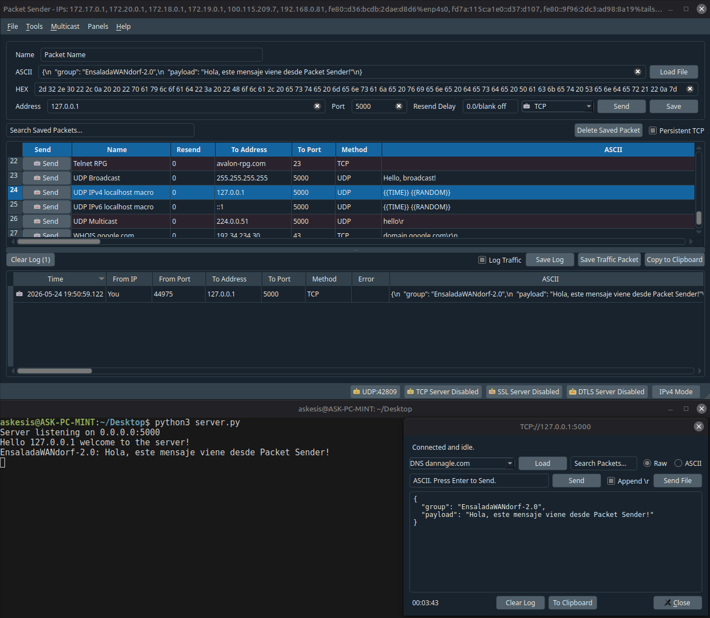
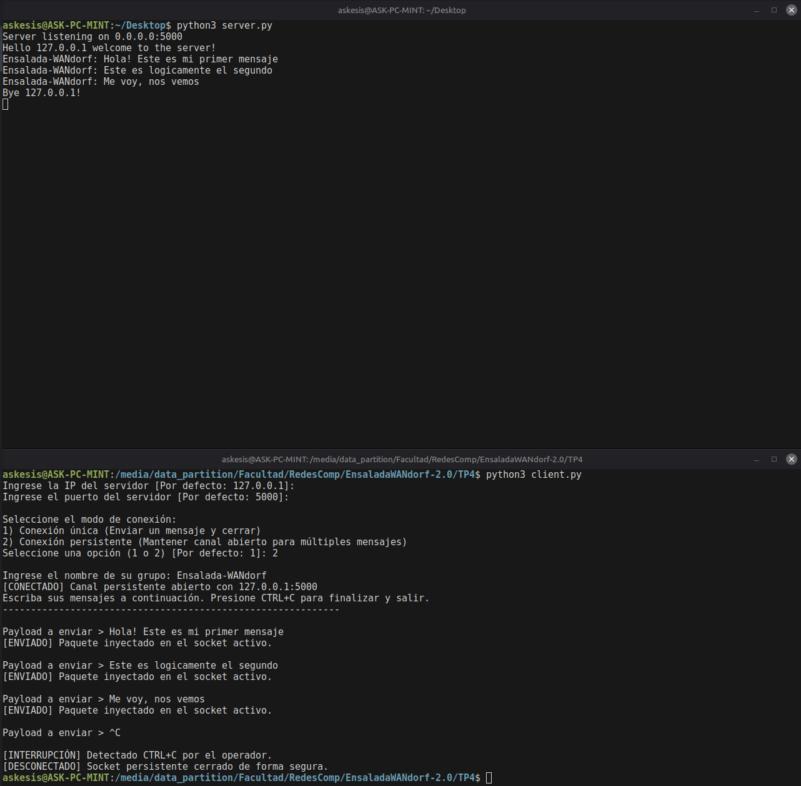
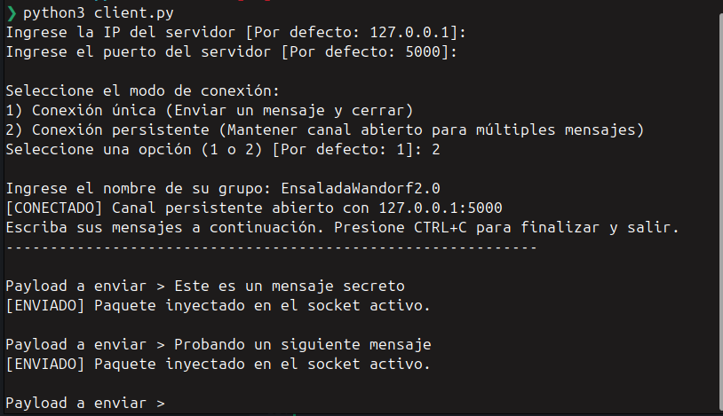
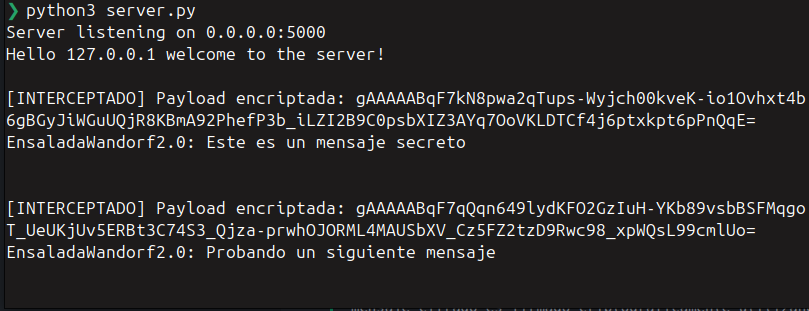

# Trabajo Practico N4

- **Gastón E. Capdevila**
- **Nicolas Seia**
- **Ignacio Ledesma**
- **Tomas Viberti**  
 
## Ensalada WANdorf 2.0

**Facultad de ciencias Exactas Fisicas y Naturales**  

**Redes de Computadoras**

**Profesores:**
- SANTIAGO MARTIN HENN
- OLIVA CUNEO FACUNDO NICOLAS 

**22/04/2026**   

---

### Información de los autores
 
- gaston.capdevila@mi.unc.edu.ar
- nicolas.seia@unc.edu.ar
- iledesma@mi.unc.edu.ar
- tomas.viberti@mi.unc.edu.ar

## Resumen

## Introducción

## Referencias

## Punto 1

### a) ¿Qué es la serialización en redes de computadoras?

En el contexto de las redes de computadoras y sistemas distribuidos, la serialización es el proceso técnico de transformar una estructura de datos o un objeto complejo en memoria (como diccionarios, listas, clases o structs de un lenguaje de programación) en una secuencia o flujo de bytes.

El propósito fundamental de este proceso radica en que los datos en memoria poseen referencias internas y punteros abstractos que solo tienen sentido dentro del proceso local que los creó. Al transmitir información a través de un canal físico o de red de datos, estos datagramas o cargas útiles deben representarse de forma lineal y unificada para viajar a través de los protocolos de transporte y enlace.

El proceso inverso se denomina deserialización, mediante el cual el nodo receptor toma ese flujo continuo de bytes recibido desde la red y lo reconstruye en una estructura de datos idéntica en su propia memoria, permitiendo así una interpretación correcta de su significado lógico.

### b) ¿Cuál es la diferencia entre serialización binaria y no binaria? Buscar ejemplos, ventajas y desventajas de cada una.

La diferencia esencial entre ambas metodologías radica en el **formato de representación física** del flujo de bytes resultante: mientras que la serialización no binaria traduce la información a texto legible por humanos (caracteres ASCII/Unicode), la serialización binaria compacta la información directamente en secuencias binarias optimizadas para las máquinas.

#### 1. Serialización No Binaria (Formatos de Texto)

* **Concepto:** Transforma las estructuras de datos en cadenas de texto plano estructuradas bajo reglas gramaticales estrictas legibles tanto por humanos como por sistemas informáticos.
* **Ejemplos:** 
  * **JSON (JavaScript Object Notation):** Formato basado en pares clave-valor (ej. `{"group": "Grupo 1", "payload": "hola"}`) ampliamente utilizado en servicios web y APIs.
  * **XML (Extensible Markup Language):** Formato basado en etiquetas jerárquicas (ej. `<group>Grupo 1</group>`).
* **Ventajas:**
  * **Legibilidad:** Facilita enormemente las tareas de depuración (debugging) y auditoría técnica de paquetes, ya que un desarrollador puede inspeccionar el tráfico en tránsito (por ejemplo, mediante Wireshark o consolas) y comprender su significado al instante.
  * **Interoperabilidad Universal:** Al basarse en estándares de texto comunes, es completamente independiente del lenguaje de programación, sistema operativo o arquitectura de hardware de los nodos emisores y receptores.
* **Desventajas:**
  * **Overhead:** Al incluir delimitadores textuales, comillas, llaves y nombres de claves repetidas en cada mensaje, los paquetes resultantes son significativamente más grandes.
  * **Mayor consumo de procesamiento:** El parseo y análisis sintáctico de texto (string manipulation) requiere ciclos de reloj adicionales de CPU para convertir caracteres a variables lógicas tanto al codificar como al decodificar.

#### **2. Serialización Binaria**

* **Concepto:** Codifica las estructuras de datos directamente en un flujo continuo de bits y bytes densamente empaquetados bajo esquemas fijos de posición o codificaciones eficientes, perdiendo toda legibilidad directa para el ojo humano.

* **Ejemplos:**
  * **Protocol Buffers (Protobuf):** Desarrollado por Google, define esquemas mediante archivos `.proto` y serializa los campos de forma binaria compacta mediante identificadores numéricos simples.
  * **MessagePack o BSON:** Extensiones binarias que compactan estructuras similares a JSON en formatos de bits optimizados.
  * **Estructuras nativas de bajo nivel:** Formatos de cabeceras de red nativas encapsuladas en tramas estándar (como los campos binarios fijos de los mensajes BGP u OSPF).

* **Ventajas:**
  * **Eficiencia extrema en el ancho de banda:** Elimina metadatos redundantes y nombres de variables repetidos, reduciendo al mínimo indispensable el tamaño de la carga útil (*payload*) transmitida por el canal.
  * **Alto rendimiento de procesamiento:** La conversión entre los datos binarios de la red y las variables de memoria nativas de la máquina es casi directa, lo que acelera de forma drástica los tiempos de serialización y deserialización (ideal para sistemas embebidos o redes saturadas).

* **Desventajas:**
  * **Complejidad en la depuración:** El flujo de bytes es ilegible sin una herramienta específica que conozca el esquema de codificación exacto (mapeo de bits); en un analizador de tráfico ordinario, solo se apreciará como "ruido" o caracteres extraños.
  * **Acoplamiento de Esquemas:** Requiere rigidez y sincronización entre el cliente y el servidor. Si el esquema de datos cambia (por ejemplo, se añade un campo), ambos extremos deben conocer la actualización para interpretar de forma correcta los offsets de bits correspondientes.

---

## Punto 2 - Verificación y Resultados Obtenidos

Como se evidencia en los logs de la terminal y en la ventana de conexión persistente del panel inferior derecho de la captura de pantalla:

1. **Establecimiento de Conexión:** El servidor detectó exitosamente el intento de conexión e imprimió la bienvenida al nodo local:
`Hello 127.0.0.1 welcome to the server!`.
2. **Deserialización y Validación:** El hilo asignado por el servidor recibió el flujo de bytes, aplicó el método de decodificación en formato `utf-8` y parseó la estructura mediante la librería `json.loads()`.
3. **Procesamiento Exitoso:** Al validar que el diccionario contenía las claves estrictas `"group"` y `"payload"`, el servidor imprimió en la salida estándar de la consola la información ya interpretada lógicamente:
`EnsaladaWANdorf-2.0: Hola, este mensaje viene desde Packet Sender!`.

Esto demuestra de forma empírica que el proceso de serialización en el origen (Packet Sender) y deserialización en el destino (servidor Python) se completó sin pérdida de integridad ni errores de formato.

---

## Punto 3 - Verificación y Resultados del Cliente Interactivo

Como se evidencia en las trazas concurrentes de las terminales de ejecución para el cliente y el servidor:

1. **Configuración de Parámetros Dinámicos y Valores por Defecto:** Al inicializar el script `client.py`, el programa solicitó de forma interactiva el direccionamiento de la capa de transporte. Al presionar la tecla Enter en los prompts de IP y Puerto, las rutinas lógicas asignaron por defecto los valores de Loopback `127.0.0.1` y el puerto TCP `5000` respectivamente. A su vez, se seleccionó la opción `2` para conmutar el comportamiento del cliente hacia el modo de conexión persistente.
2. **Establecimiento de Sockets y Persistencia del Canal:** Tras ingresar el identificador del grupo (`Ensalada-WANdorf`), el cliente invocó la llamada del sistema `connect()`, completando el 3-way handshake con el backend. Esto se constata en la terminal superior, donde el hilo del servidor de escucha remota arrojó el mensaje:
`Hello 127.0.0.1 welcome to the server!`.
El descriptor del socket se mantuvo abierto en memoria de forma continua, evitando la sobrecarga de reconexión ante ráfagas de tráfico.
3. **Ciclo de Serialización e Inyección de Cargas Útiles:** A través del bucle interactivo, se enviaron tres payloads secuenciales. En cada iteración, el script estructuró el diccionario con las claves `"group"` y `"payload"`, ejecutó la serialización a un string plano mediante `json.dumps()` y empaquetó el flujo de bytes codificado en `utf-8` a través de la primitiva de red `sendall()`.
El servidor procesó de forma transparente los tres bloques de datos en la misma sesión, imprimiendo en orden cronológico:
   * `Ensalada-WANdorf: Hola! Este es mi primer mensaje`
   * `Ensalada-WANdorf: Este es logicamente el segundo`
   * `Ensalada-WANdorf: Me voy, nos vemos`
4. **Manejo de Interrupciones y Cierre Seguro del Enlace:** Al presionar la combinación de teclas **CTRL+C** (`^C`), el entorno interceptó la señal `SIGINT`. La estructura de control interna detuvo el bucle de envío de forma limpia sin generar excepciones abruptas en los descriptores del sistema operativo. El bloque finalizador ejecutó la desconexión segura del socket, permitiendo que el servidor liberara el hilo concurrente e imprimiera el log de cierre de socket: `Bye 127.0.0.1!`.

---

## Punto 4 - Implementación de Seguridad (Cifrado Simétrico)

Para dotar de confidencialidad e integridad a la comunicación entre el cliente y el servidor, se implementó un esquema de cifrado sobre el contenido del mensaje, manteniendo la estructura general del paquete JSON intacta.

### a) Implementación del cifrado en el lado del cliente
Se utilizó la librería `cryptography` de Python, específicamente el módulo estandarizado `Fernet`. En el cliente, se definió una clave estática compartida (`SECRET_KEY`). Al momento de capturar el ingreso del usuario, antes de ensamblar el diccionario JSON, el sistema encripta exclusivamente el valor correspondiente a la carga útil (`payload`), convirtiendo el texto plano en un token seguro incomprensible.

### b) Verificación en el servidor
En el backend, el servidor intercepta el flujo JSON. Para verificar empíricamente que la información viaja encriptada y protegida contra *sniffers* de red (como Wireshark), se implementó un log que imprime la payload en crudo (`raw`) antes de su procesamiento. Una vez documentado e interceptado el texto cifrado *(ver captura a continuación)*, el servidor procede a desencriptar la carga útil utilizando la misma clave compartida y la expone en su formato original.

*[Espacio reservado para capturas de pantalla de la terminal mostrando el payload encriptado en el servidor]*

### c) Características de la técnica de cifrado utilizada

El esquema implementado a través de **Fernet** proporciona una seguridad robusta en la capa de aplicación al integrar múltiples mecanismos de protección criptográfica:

1. **Cifrado Simétrico (AES):** Utiliza la misma clave criptográfica matemática tanto en el origen (cliente) para encriptar como en el destino (servidor) para desencriptar. Internamente, se basa en el **Advanced Encryption Standard (AES)** con una clave de 128 bits.
2. **Vector de Inicialización (IV) y Modo CBC:** Opera en modo *Cipher Block Chaining*. Fernet genera un vector de inicialización pseudoaleatorio distinto para cada paquete enviado. Esto asegura que si el usuario envía el mismo mensaje exacto dos veces consecutivas, el texto cifrado que viaja por la red será completamente diferente, impidiendo ataques estadísticos o de deducción de patrones.
3. **Autenticación e Integridad (HMAC-SHA256):** Esta técnica no se limita a brindar confidencialidad. Cada mensaje cifrado es firmado criptográficamente utilizando *HMAC (Hash-based Message Authentication Code)* con el algoritmo SHA256. Esto garantiza que si un atacante *Man-in-the-Middle* intercepta el paquete y modifica un solo bit del payload cifrado en un intento por corromperlo, el servidor detectará la manipulación al instante al intentar validar la firma y abortará la operación.
4. **Compatibilidad de Formato de Red (Base64):** El token cifrado resultante está empaquetado y codificado en formato de texto url-safe **Base64**. Esta característica es vital para la serialización, ya que permite introducir los bytes resultantes del cifrado dentro del esquema JSON en formato de texto plano sin generar caracteres especiales que puedan romper la estructura sintáctica del mensaje.

### Pruebas

#### Cliente

#### Servidor

---

## **Fuentes Bibliográficas de Referencia**

* **Comer, D. E. (2014).** *Internetworking with TCP/IP Vol. I: Principles, Protocols, and Architecture* (6th ed.). Pearson Education. *(Capítulos referenciales sobre encapsulamiento en la capa de transporte, stream de datos y delimitación lógica de mensajes a nivel de aplicación).* 

* **Stallings, W. (2004).** *Comunicaciones y redes de computadores*. Pearson Educación. *(Capítulo 12 y secciones de soporte técnico sobre eficiencia arquitectónica, overhead de control y requisitos funcionales en el intercambio de datos).* 
